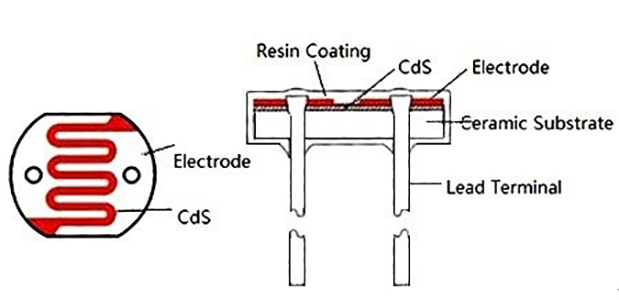
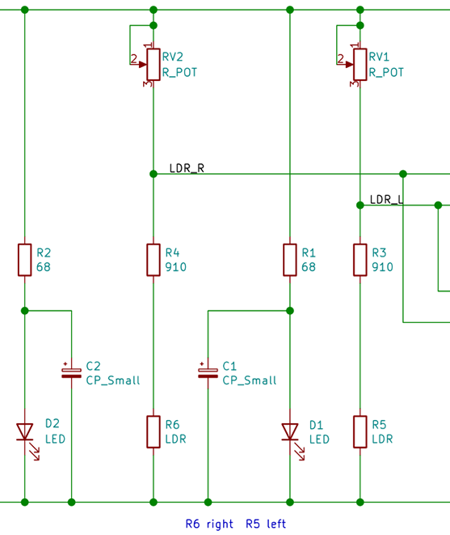

# Hardware analysis and calibration

## Drive circuit

This is a basic circuit:

Battery, diode, inductor and manual switch are connected in series,two loads are connected in parallel. 

One load is a motor and the other load is a light-emitting diode. 

In order to protect the light-emitting diode, a resistor for voltage division is connected in series.

In this circuit, the only one that can control the two loads is a manual switch.

A **bipolar junction transistor (BJT)** is a type of transistor that uses both electrons and electron holes as charge carriers. In contrast, a unipolar transistor, such as a field-effect transistor, uses only one kind of charge carrier. A bipolar transistor allows a small current injected at one of its terminals to control a much larger current flowing between two other terminals, making the device capable of amplification or switching.

A BJT consists of three differently doped semiconductor regions: the emitter region, the base region and the collector region. These regions are, respectively, p type, n type and p type in a PNP transistor, and n type, p type and n type in an NPN transistor. Each semiconductor region is connected to a terminal, appropriately labeled: emitter (E), base (B) and collector (C).

PNP transistor：

* pin 1 Emitter
* pin 2 Base
* pin 3 Collector

> For more detailed information, you can continue to refer to[Wikipedia：Bipolar junction transistor](https://en.wikipedia.org/wiki/Bipolar_junction_transistor)

Add a PNP transistor to the circuit:

As shown in figure design circuit may control the PNP transistor of the Base, Base terminal level signal is given, the PNP transistor can be used as a switch.

The turn-on condition of Emitter and Collector is that the Emitter voltage is greater than the Collector voltage, the Emitter voltage is greater than the Base voltage, and when the Base voltage is greater than or equal to the Emitter voltage, it turns off. 

In this way, the two loads can be controlled by the level signal received by the Base, and this level signal is provided by the output of the voltage comparator.Another button can also be used to switch to micro:bit or web:bit development boards to provide level signals. 

The R7 resistor acts as a pull-up resistor here. When there is no control signal input to the Base, the control signal output terminal is left floating, neither high nor low, similar to an open circuit state. Through the pull-up resistor of R7, Base can also obtain a high level and keep the PNP off state, so that this circuit can only be turned on when Base obtains a low-level signal. 

> For more detailed information about "high & low level" and "level signal", please refer to [Wikipedia：Logic level](https://en.wikipedia.org/wiki/Logic_level)

## Line detection circuit

At the bottom of the Triode-Car, there are two line detection circuits, each of which contains a photoresistor and an LED. When the light of the LED shines on the black and white materials, the resistance value of the photoresistor will change significantly due to the difference in reflectivity. 

On Triode-Car, the photoresistor used is GL5506. The resistance of this model will decrease with the increase of light. The light resistance (10 Lux illumination) is 2-5KΩ, and the dark resistance is 0.2MΩ.

Light resistance: The resistance value measured under 10 Lux illumination with a standard light source (color temperature of 2854K) after being irradiated with 400-600 Lux illumination for 2 hours.

Dark resistance: the resistance value measured at 10 seconds after turning off the 10 Lux illumination. 

Design a circuit like this: 

It can be seen that the branch composed of RV1 adjustable resistance, R3 resistance, and R5 photoresistor is connected in parallel with the branch composed of RV2 adjustable resistance, R4 resistance, and R6 photoresistor.

According to the principle of parallel equal-voltage shunting, the voltages of the two branches are equal.

On the branch where the R5 photoresistor is located, according to the principle of series voltage division and equal current, the voltage at the LDR_L node is equal to the current value multiplied by the (R5+R3) resistance value.

When the light received by the R5 photoresistor is weakened, its resistance will increase, and the voltage at the LDR_L node will increase accordingly, and vice versa when the light increases.

The same is true for LDR_R node voltage.

According to the principle of series voltage division and equal current, if the resistance of the adjustable resistor of RV1 is increased, the voltage at the LDR_L node will decrease, and vice versa.

The RV2 adjustable resistor is the same.

In this way, the two adjustable resistors can be used to calibrate the voltage values of the two nodes of LDR_R and LDR_L, and try to ensure that the voltage values of the two nodes are equal under the same light intensity, so as to facilitate subsequent applications on the voltage comparator.

## Voltage comparator 

This is the schematic diagram of the LM393 voltage comparator: 

Two voltage comparators are integrated inside. When the positive input (IN+) of the voltage comparator is greater than the negative input (IN-) voltage, the output is high. Otherwise, the output is low.

The internal schematic diagram of its voltage comparator is like this: 

This shows,the realization of such a relatively complex function is also designed and packaged based on basic components such as semiconductor diode and BJT. 

> If you are interested, you can refer to [Wikipedia：Comparator](https://en.wikipedia.org/wiki/Comparator)

Add LM393 voltage comparator to the circuit, and complement the drive circuit and line detection circuit：

At this point, we have basically constructed an automatic control system.

Under ideal working conditions, it can collect light and dark information on the left and right sides of the line through the photoresistor within a certain range.

The voltage comparator continuously controls the start and stop of the two wheels during the information change to correct the driving direction and achieve the purpose of automatic line tracking.

## State relation table 

| Car lean Direction | Right LDR(R6) | Left LDR(R5) | LDR_R Potential | LDR_L Potential | P3 Input | P2 Input | P1 Output | P5 Input | P6 Input | P7 Output | M1 Left Motor | M2 Right Motor | Car Move Direction |
|:---:|:---:|:---:|:---:|:---:|:---:|:---:|:---:|:---:|:---:|:---:|:---:|:---:|:---:|
| Right | Bright | Dark | 0 | 1 | 0 | 1 | 0 | 1 | 0 | 1 | 1 | 0 | Left |
| Left | Dark | Bright | 1 | 0 | 1 | 0 | 1 | 0 | 1 | 0 | 0 | 1 | Right |

> Conditions are black lines and white roads 

When the front of the car is biased to the right compared to the line:

1. The R6 photoresistor on the right under the front of the car will come above the white road, and the R5 photoresistor on the left will come above the black line.
2. The resistance of R6 decreases and the resistance of R5 increases, and the potential of the LDR_R node will be lower than the potential of the LDR_L node.
3. The P3 pin potential of the A comparator will be lower than the P2 pin potential, and the P5 pin potential of the B comparator will be higher than the P6 pin potential.
4. The P1 pin of the A comparator will output a low level, and the P7 pin of the B comparator will output a high level.
5. Q2 PNP transistor turns on, M2 right motor starts, Q1PNP transistor turns off, M1 left motor stops.
6. The car will drive to the left.

When the front of the car is biased to the left compared to the line, the car will also drive to the right.

In this way, Triode-Car can automatically reverse correction regardless of the yaw to the left or right to achieve the purpose of tracking the line.

## line detection circuit calibration 

In order to make the line detection circuit have higher sensitivity to light and dark changes under the control of the LM393 chip alone, and to reduce the potential difference under the same illumination brightness, it is necessary to manually adjust the adjustable resistance for calibration. 

The calibration steps are as follows: 

1. use a small object to lift up the back wheels slightly to prevent contact,point a stable light source towards the photoresistors.
2. Adjust either side of potentiometers until both motors are operating simultaneously.
3. After adjustments, put the car on the track to test the results.
4. If the car is still likely to run out of the track, place the car on a white paper, repeat steps 2~3 for fine-tuning, and try to make the line detection circuit more sensitive to light and dark changes. 

