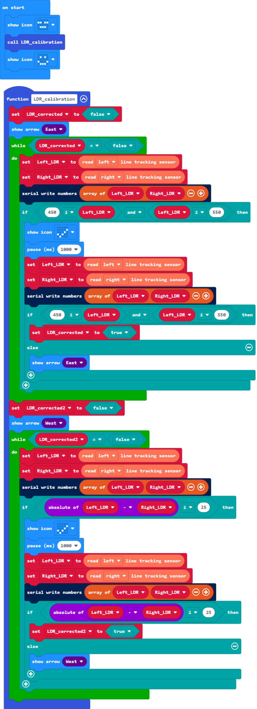

# Calibration line detection circuit

## Design ideas

As every component are not made exactly the same, despite being made according to the datasheet, they would vary from eachother ever so slightly. Calibration of the Line-Following Circuit improves the reaction time of the Triode-Car's line tracking feature. Adjust the resistance of the potentiometers connected to the photoresistors to increase the sensitivity. This process makes the Triode-Car less likely to run off course and maintains a stable analog voltage output.

We can directly use the [Collect the signals](read_LDR.html)guide from beginners tutorial to read the analog signals from the computer, then manually adjust the potentiometer with a screwdriver.

The micro:bit can detect analog voltage values from 0~1023, the closer the value is to the middle, the reaction from changes of brightness detected by the photoresistor will become more sensitive.

Therefore, under a stable brightness environment, try to calibrate the resistance as close to 512 as possible. This would create more stable energy output and reduce their analog value difference.

The above steps mentioned requires constant connection with triode-car connected to micro: bit and then to the PC. In a real use case scenerio, one would best be using manual adjustments to increase the sensitivity.

We cannot be sure to have the micro: bit connected to the PC all the time, therefore, we need to write a program to guide us how to properly calibrate the sensitivity.

Calibration Steps:

1. Adjust the left potentiometers first, to make its analog value out close to the median.
2. Adjust the right potentiometer on the premise that the previous condition is met, so that the parallel photoresistor output voltage analog quantity on the corresponding pin of Micro:Bit is close to the other photoresistor.

We can achieve this by creating a simple "if" statement program. For those people who adjust manually, we could add different image patterns to indicate if we have adjusted properly.

## Example Blocks:

[Example project file on Github](https://github.com/Wind-stormger/Makecode/blob/master/microbit-Triode-car_LDR_calibration_2.hex)

> After the project file is downloaded locally, it can be imported into MakeCode for viewing and re-editing, or it can be burned directly to micro:bit via USB to run.

## Design description 

1. The whole calibration code is organized into a self-defined function, this could be easily called or maintained later on and would cause less confusion as many other functions would be added.
2. The code consists within a while loop block. By adding loop conditions, the loop would exit after the potentiometers have finished calibration.
3. Before entering the while loop, the micro:bit would display a directional arrow, indicating which potentiometers requires adjustment.
4. The code within the first while loop block is to calibrate the left photoresistor, the "if" statement conditions are set to make the left photoresistor's analog voltage value in the range of minimum of 450 to 550 max.
5. When the "if" statement contitions are met in the 4th point, the micro:bit would display a "checked" symbol to give a visual feedback as its been calibrated. At this moment one should stop adjusting the left potentiometer. After 1 second, the code would run the "if" statement again to check if the values are disrupted due to slight tremor of the hand. When the code double checked if conditions are met, the loop will end.
6. The second while loop contains blocks to adjust the right photoresistor. The "if" statement within is to make the analog voltage values differce of both potentiometers less than 25. This is achieved by subtracting the values of both left and right photoresistors.