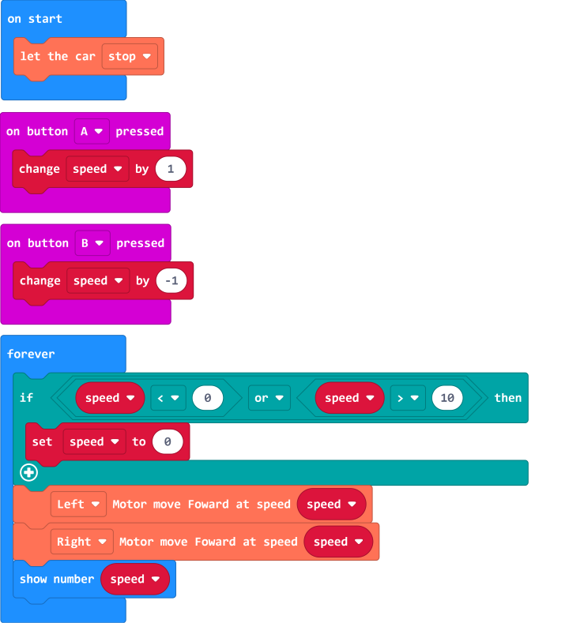

# Adjust motors speed

## Example Blocks 

[Example project file on Github](https://github.com/Wind-stormger/Makecode/blob/master/microbit-Triode-car_motor_control_2.hex)

> After the project file is downloaded locally, it can be imported into MakeCode for viewing and re-editing, or it can be burned directly to micro:bit via USB to run. 

## Design description 

1. Press button A once to increase the speed by 1 level.
2. Press button B once to reduce the speed by 1 level.
3. The micro:bit displays the current level value. 

In the Triode-Car extension, there are blocks that can independently control the speed of the left and right motors, and can perform 10-level speed regulation. 

In the example, the "forever" block will start an infinite loop after the execution of the "on start" block, and execute other event handlers, such as "on button A/B pressed", between each loop.

A "if" judgment block is added. If the value of the variable "speed" is less than 0 or greater than 10, the value of the variable "speed" is set to 0, so that the value can be limited to the range of 0 to 10 without overflowing and reporting an error. 