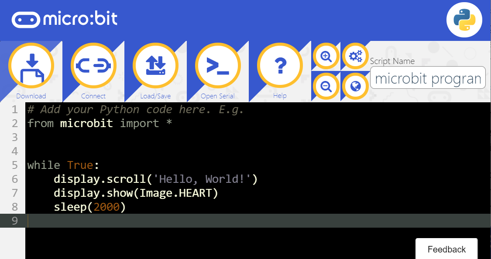

# First meeting with micro:bit

The [micro:bit](https://microbit.org/)(also referred to as BBC Micro Bit) is an open source hardware ARM-based embedded system designed by the BBC for use in computer education.This is jointly developed by partners such as Microsoft, Samsung, ARM, Lancaster University, etc. They currently have designed two models, V1 and V2, the latter has a slightly stronger performance than the former.

## MakeCode editor

MakeCode is a graphical code editor for programming education promoted by Microsoft. It is also the code editor for micro:bit's current mainstream applications. You don't need to download and install any local applications. You can open the webpage in the browser to program online. 

[micro:bit-MakeCode ](https://makecode.microbit.org/#)

In the MakeCode editor, you can start by building blocks with zero programming foundation, and you can use Extensions’ blocks that have encapsulated more complex programs, further reducing the threshold. Localization support for multiple languages is also an important advantage. 

The editor is mainly composed of three parts, a graphical block editor, a simulation simulator, and a JavaScript code editor. 

## MicroPython editor

MicroPython is a relatively advanced but not difficult to learn programming language.Micro:bit provides easier-to-use modules to reduce the difficulty of programming. The biggest difference between micro:bit and graphics programming is that it is transformed into abstract character codes.

[micro:bit-micropython](https://python.microbit.org/v/2)

As the name suggests, it is a streamlined and efficient implementation of the Python 3 programming language. It contains a small subset of the Python standard library and is optimized to run on microcontrollers and in restricted environments. 

If you have ever learned Python, it will be quite easy to get started. On the contrary, after learning MicroPython on the development board, you can switch to Python for further learning or application development almost without obstacles. 

