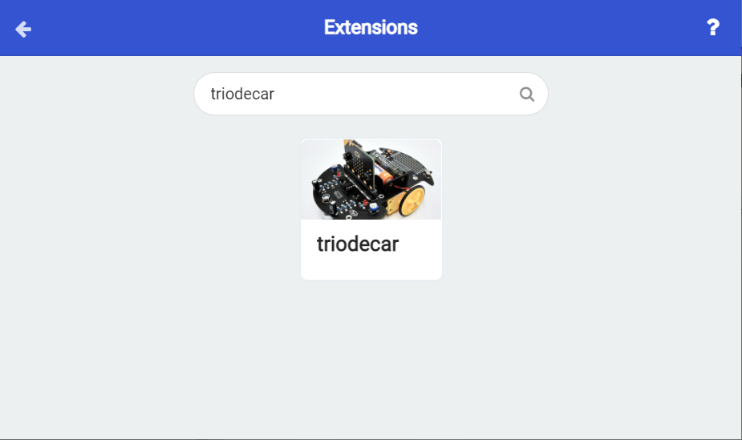

# Import extensions

1.In the MakeCode editor, click the gear icon in the upper right corner of the webpage, and click Extensions. 

2.Enter a page to retrieve various extensions. 

3.Enter `triodecar` in the search bar above.You can see the extensions dedicated to Triode-Car.

4.Click to add it to the project, and you can see several extension blocks in the block list of the MakeCode editor.

