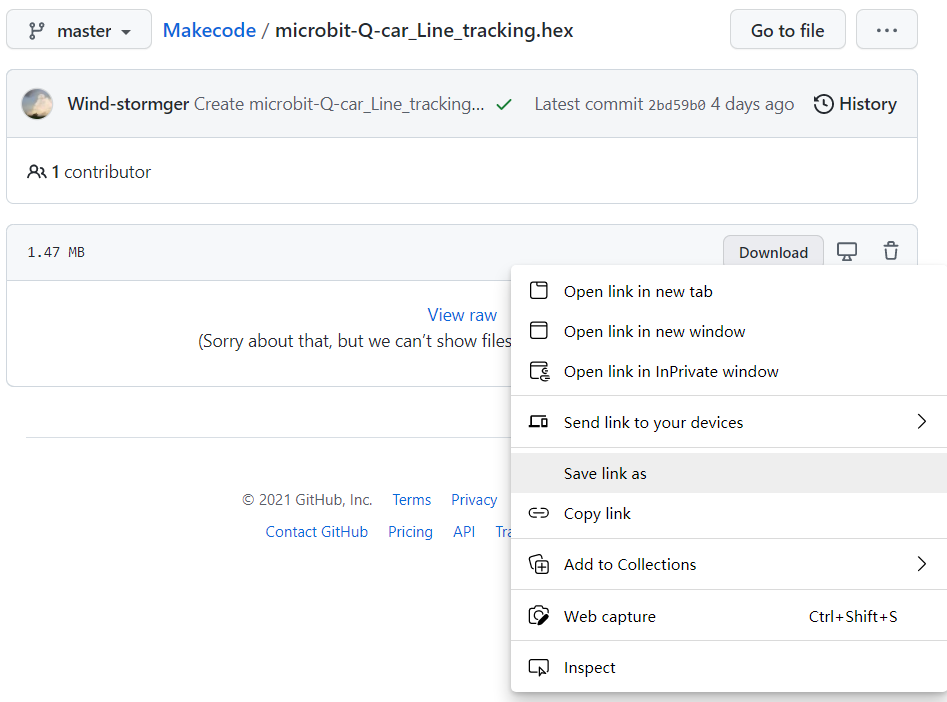

# Create MakeCode project

1.Open the web link ：

[micro:bit-MakeCode](https://makecode.microbit.org/#)

2. Click "New Projects" and then give the project a name to enter the editor. 

3.In addition to saving the project as a `.hex` file, it can also be saved as a Github project, which requires a [Github](https://github.com/) account and associated login with MakeCode. 

4.The links provided by all subsequent examples are links to `.hex` files, and you do not need to log in to your Github account to download them. In the webpage opened by the link, right-click the `Download` button, and then click `save link as` to download the `.hex` file to the local hard disk of the computer.

