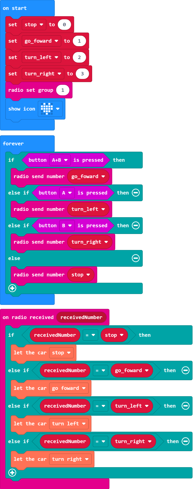

# Control the motors by radio

## Example Blocks

[Example project file on Github](https://github.com/Wind-stormger/Makecode/blob/master/microbit-Triode-Car_radio_control_1.hex)

> After the project file is downloaded locally, it can be imported into MakeCode for viewing and re-editing, or it can be burned directly to micro:bit via USB to run.

## Design description 

The micro:bit supports radio communication. Use the radio extension to program in MakeCode, and after downloading the program into two micro:bits, you can establish radio communication between the two and control each other's hardware. 

Download the routine into two micro:bits, plug one into the Triode-Car, hold the other in your hand, and connect the power to both of them, and you can control the start and stop of the Triode-Car's motor through the micro:bit button AB in your hand. 

Press A to turn left, press B to turn right, press AB at the same time to go straight, release the buttons to stop. 

The four variables added are not superfluous. Although you can also fill in the values we need in the building blocks, using variable names to replace these specified values helps us to establish a clearer cognitive logic. The more complex the program, the more its value can be reflected. 