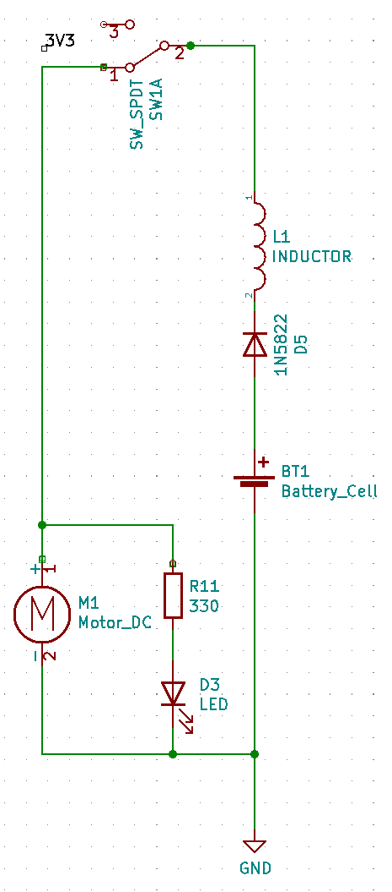
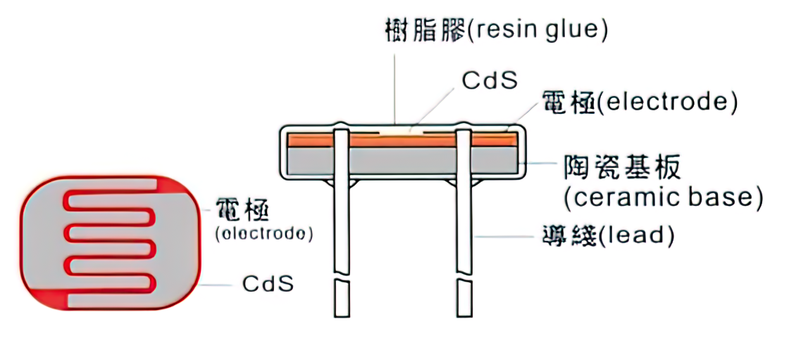
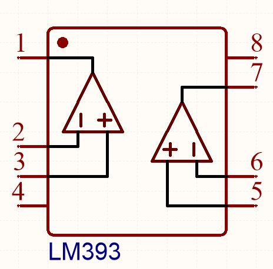
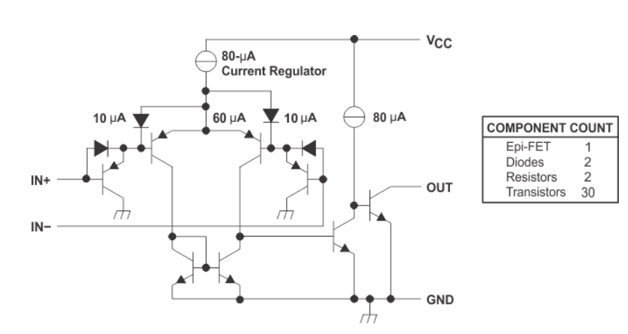
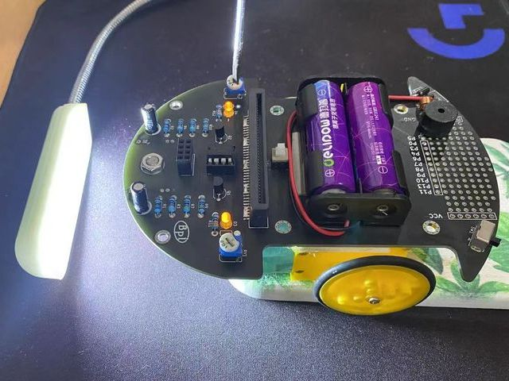

# TriodeCar硬件分析及校准

## 驱动电路

这是一个最基础的电路：

电池，二极管，电感，手动开关四者串联，两个负载并联接入，一个负载是电机，一个负载是发光二极管，作为对发光二极管的保护又给其串联了一个用于分压的电阻。

在这样的电路中唯一能控制两个负载的只有一个手动开关。

这是PNP型三极管：

* 1脚 Emitter发射极
* 2脚 Base基极
* 3脚 Collector集电极

> 一般在原理图中三极管的E、B、C指的就是此三脚。

**双极性结型晶体管**（bipolar junction transistor, BJT），俗称**三极管**，是一种具有三个终端的电子器件，由三部分掺杂程度不同的半导体制成。双极性晶体管是电子学历史上具有革命意义的一项发明，其发明者威廉·肖克利、约翰·巴丁和沃尔特·布喇顿被授予1956年的诺贝尔物理学奖。

在双极性晶体管电学符号中， Base基极 和 Emitter发射极 之间的箭头指向电流的方向，这里的电流为电子流动的反方向。PNP型晶体管的箭头从 Emitter发射极 指向 Base基极 ，而NPN型与之相反。

> 想了解其更详尽的信息，可以继续参考[维基百科：双极性晶体管](https://zh.wikipedia.org/wiki/%E5%8F%8C%E6%9E%81%E6%80%A7%E6%99%B6%E4%BD%93%E7%AE%A1)，或者检索其他相关的文献资料，需要具备相应的 数理化 前置知识才能更好的理解。

将一个PNP型三极管加入电路：

设计这样的电路可以控制PNP型三极管的2脚 Base基极 电压，这个PNP型三极管即可作为一个**开关**使用。

1脚 Emitter发射极 与 3脚 Collector集电极**导通**条件为，Emitter发射极电压大于Collector集电极电压，Emitter发射极电压大于Base基极电压。而当Base基极电压大于或等于Emitter发射极电压时则**关断**。

两个负载被 Base基极 所接收到的电平信号所控制，而此电平信号则由 电压比较器 的输出端提供，通过另一个开关还可切换至由 micro:bit 或 web:bit 开发板来提供。

R7 在这里起到一个**上拉电阻**的作用，即使没有给2脚 Base基极输入控制信号，控制信号输出端悬空，既没有给高电平也没给低电平，类似于开路的状态，通过R7上拉电阻，也能使2脚 Base基极获得一个高电平，保持PNP三极管关断的状态，使得此电路仅在2脚 Base基极获得低电平信号时才可导通。

> 有关“高低电平”、“电平信号”更详尽的信息可以参考[百度百科：逻辑电平](https://baike.baidu.com/item/%E9%80%BB%E8%BE%91%E7%94%B5%E5%B9%B3)，或者检索其他相关的文献资料。

## 巡线检测电路

在Triode-Car的底部，有两个巡线检测电路，每一路包含了一个光敏电阻和一个LED。当LED的光照到黑色和白色的材料上面时，由于反射率的不同，光敏电阻的阻值会发生明显的变化。

在Triode-Car上，光敏电阻使用的器件型号是GL5506，**其电阻值会随着光照的加强而减小**，亮电阻（10Lux）是2-5KΩ，暗电阻是0.2MΩ。
亮电阻：用400-600Lux光照射2小时后，在标准光源（色温2854K）10Lux光照下的测量的电阻值。
暗电阻：关闭10Lux光照后第10秒测量的电阻值。

设计这样的电路：

可以看到，由RV1可调电阻、R3电阻、R5光敏电阻组成的支路与由RV2可调电阻、R4电阻、R6光敏电阻组成的支路是并联的。

根据并联等压分流的原理，两条支路电压相等。

在R5光敏电阻所在的支路上，根据串联等流分压的原理，LDR_L 节点电压等于电流值乘以（R5+R3）阻值，当R5光敏电阻所受光照减弱，其阻值将增大， LDR_L 节点电压随之增大，反之光照增强时也同理。

LDR_R 节点电压亦同理。

根据串联等流分压的原理，若使RV1可调电阻的阻值增大，LDR_L 节点电压则会减小，反之同理。

RV2可调电阻亦同理。

这样，两个可调电阻即可用于校准 LDR_R 与 LDR_L 两个节点的电压值，尽量保证相同光照强度下两个节点电压值相等，以便后续 电压比较器 的应用。

## 电压比较器

这是LM393电压比较器的原理图:

其内部集成了两个电压比较器，当电压比较器的同相输入端(IN+)大于反相输入端(IN-)电压时，输出高电平，反之则输出低电平。而其电压比较器的内部原理图则是这样：

由此可见，实现 **“比较两个输入端的电压大小”** 这样相对复杂的功能，也是基于二极管、三极管等基础元件来设计并封装而成的。

> 此处不对其做更深入的原理分析，感兴趣的可以参考[维基百科：比较器](https://zh.wikipedia.org/wiki/%E6%AF%94%E8%BE%83%E5%99%A8)，或者检索其他相关的文献资料。

将LM393电压比较器加入电路中，并补全驱动电路和巡线检测电路(`单击图片可放大查看`)：

至此，我们就基本构建出一个自动控制系统，在其较为理想的工作状况下，它可以在一定范围内经由光敏电阻采集左右两侧道路明暗的信息，电压比较器在信息变化中不断的分别控制着两个轮子启停，以修正行驶方向。

## 各元件的信号与工作状态关系表

| 车头相较线路偏向 | (右)R6 LDR光感 | (左)R5 LDR光感 | LDR_R 电位 | LDR_L 电位 | P3输入 | P2输入 | P1输出 | P5输入 | P6输入 | P7输出 | M2右电机 | M1左电机 | 小车行进方向 |
|:---:|:---:|:---:|:---:|:---:|:---:|:---:|:---:|:---:|:---:|:---:|:---:|:---:|:---:|
| 右 | 明 | 暗 | 0 | 1 | 0 | 1 | 0 | 1 | 0 | 1 | 1 | 0 | 左 |
| 左 | 暗 | 明 | 1 | 0 | 1 | 0 | 1 | 0 | 1 | 0 | 0 | 1 | 右 |

> 条件为黑色线路与白色路面

以车头相较线路偏向 右 为例：

1. 车头下部右侧R6光敏电阻将来到白色路面上方，而左侧R5光敏电阻将来到黑色线路上方。
2. R6阻值减小，R5阻值增大，LDR_R节点电位将低于LDR_L节点电位。
3. A比较器的P3引脚电位将低于P2引脚电位，B比较器的P5引脚电位将高于P6引脚电位。
4. A比较器的P1引脚将输出低电平，B比较器的P7引脚将输出高电平。
5. Q2PNP三极管导通，M2右电机启动，Q1PNP三极管截止，M1左电机停止。
6. 小车将向左行驶。

当车头相较线路偏向 左 时，小车同样会向右行驶。

这样无论偏左偏右，Triode-Car都能自动的反向修正，达到沿着线路行驶的目的。

## 巡线检测电路的校准

为了使巡线检测电路在单独使用LM393芯片控制的状态下有着对明暗变化更高的灵敏度，以及减少相同光照亮度下的电势差，需要通过手动调整可调电阻来进行校准。

校准步骤如下：

1. 将小车用小物件微微将轮子抬起以防接触表面，将小车的光敏电阻对准一个稳定光源（台灯或手电筒）。
2. 随意调整任一边可调电组，直到两侧马达同时运转。
3. 调整完成后，放置在跑道上测试结果。
4. 若小车还是有概率冲出跑道，将小车放置于白纸上，重复2~3步骤进行微调，尝试使巡线检测电路对明暗变化有更高的灵敏度。

