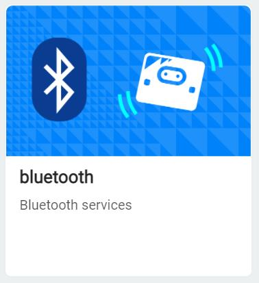
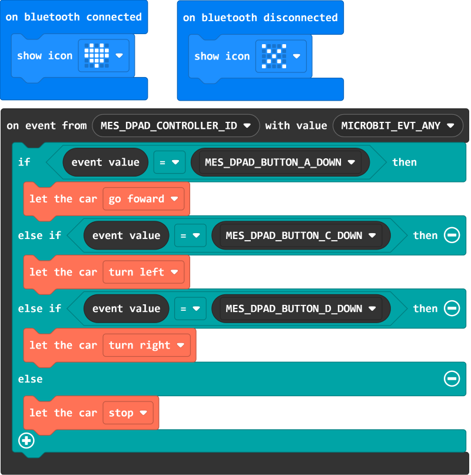

# 蓝牙控制

## 介绍

micro:bit支持蓝牙通讯，在MakeCode中应用蓝牙扩展积木进行编程，在支持蓝牙通讯的Apple或Android设备上安装APP即可通过蓝牙无线控制。

* 适用iPhone或iPad：[官方APP micro:bit App Store链接](https://apps.apple.com/cn/app/micro-bit/id1092687276)

* 适用Android手机或平板：[第三方APP microbit-blue Github链接](https://github.com/microbit-foundation/microbit-blue/raw/master/releases/ble_demo_v1_5_4.apk)或：[第三方APP Kitronik Move Google Play链接](https://play.google.com/store/apps/details?id=com.kitronik.blemove)

> App Store中的官方APP micro:bit有蓝牙控制功能。Google Play商店有官方APP micro:bit，但没有蓝牙控制功能，所以需要第三方APP来实现蓝牙控制功能。

## 蓝牙配对流程及注意事项

* 在MakeCode中，点击Extension，在页面中选择Bluetooth，移除Radio功能，即可将micro:bit的无线通讯功能切换为Bluetooth。

* 当micro:bit蓝牙配对的是Android设备且使用的APP为第三方APP时，应当在MakeCode中"Project Setting"项目设置中勾选"Passkey pairing: Pairing requires 6 digit key to pair."。
* micro:bit通电开机后，同时按下按钮AB并保持按下的状态，再点按一次Reset复位键，保持读条进度完成，即可进入蓝牙配对模式。
* Android设备应打开GPS和蓝牙功能(需要开启GPS功能才可保持连接稳定)。
* 进入Android系统的蓝牙设置内找到micro:bit并与之配对，开始配对时micro:bit会提示按一次按钮A，按下一次后将连续显示6位配对码，将其输入Android设备上显示的蓝牙配对码输入框中，稍等片刻即可配对成功。
* 建议配对成功后再按一次Reset复位键将micro:bit复位。
* Apple设备如iPhone或iPad则无需进入系统的蓝牙设置，使micro:bit进入蓝牙配对模式后遵照官方APP micro:bit内的操作提示一步步操作即可完成配对。

## 例程

[在Github上的例程项目文件](https://github.com/Wind-stormger/Makecode/blob/master/microbit-Triode-car_bluetooth_control_1.hex)

> 项目文件下载到本地后可导入MakeCode中查看和再编辑，也可直接通过USB烧录到Micro:Bit中运行。

## 设计说明

蓝牙连接时显示一个红心图案，蓝牙断开时显示一个错误图案，使用Apple或Android设备上安装的APP的蓝牙控制功能即可无线控制Triode-Car，蓝牙控制端按钮A按下小车前进，按钮C按下小车左转，按钮D按下小车右转，松开即停车。

其中on event from()with value()积木在Control选项栏中。