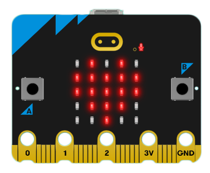

# 初识 micro:bit

[micro:bit](https://microbit.org/) 是一款由英国广播电视公司为青少年编程教育设计，并由微软，三星，ARM，英国兰卡斯特大学等合作伙伴共同完成开发的微型电脑，目前推出V1，V2两款，后者较比前者性能稍强。

## MakeCode编辑器
MakeCode 是微软所推行的应用于编程教育的图形编程语言，也是 micro:bit 目前主流应用的编程语言，无需下载安装任何本地应用，在浏览器中打开网页即可在线编程。

[micro:bit-MakeCode 网页链接](https://makecode.microbit.org/#)

在MakeCode编辑器中可以在零编程基础的情况下通过搭建图形积木的方式入门，更有将实现比较复杂的程序封装起来的扩展积木可以使用，进一步降低门槛，对多国语言的本地化支持也是其重要的优势。

其编辑器主要由三个部分组成，图形化积木（blocks）编辑器，仿真模拟器，图形化积木所对应的JavaScript代码编辑器。

## MicroPython编辑器

MicroPython是相对进阶但也并不难上手学习的编程语言，micro:bit 更有提供较为易用的模块来降低对其编程难度，其相对图形编程最大的不同就是转变为抽象的字符代码。

[micro:bit-micropython 网页链接](https://python.microbit.org/v/2)

如其名所述，它是 Python 3 编程语言的一个精简高效的实现，它包含了 Python 标准库的一小部分子集，并且经过优化，可以在微控制器上和受限环境中运行。

如果曾经学过python，那将会相当容易上手，反之在开发板上学习了MicroPython后，也能几乎无障碍地切换到python做进一步的学习或开发应用。

