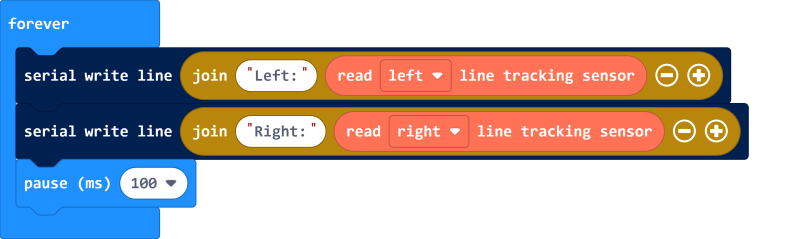

# 采集巡线检测电路的电压模拟信号

## 例程

[在Github上的例程项目文件](https://github.com/Wind-stormger/Makecode/blob/master/microbit-Triode-car_read_LDR.hex)

> 项目文件下载到本地后可导入MakeCode中查看和再编辑，也可直接通过USB烧录到Micro:Bit中运行。

## 设计说明

1. 每间隔100ms通过USB串口将读取到的左右两个传感器的电压模拟值发送给电脑。
2. 可以在在MakeCode中打开控制台查看实时接收到的信息。

硬件原理参考[硬件的浅析与调试](../hardware/analysis&calibrate.html)中的介绍。

Triode-Car专用扩展积木中有可采集巡线检测电路的电压模拟信号的"read left/right line tracking sensor"积木。

micro:bit引脚对0至3.3V电压测量精度为10bit即2^10=1024级，所以调用"read left/right line tracking sensor"积木从对应引脚读到的电压模拟值将为0至1023。