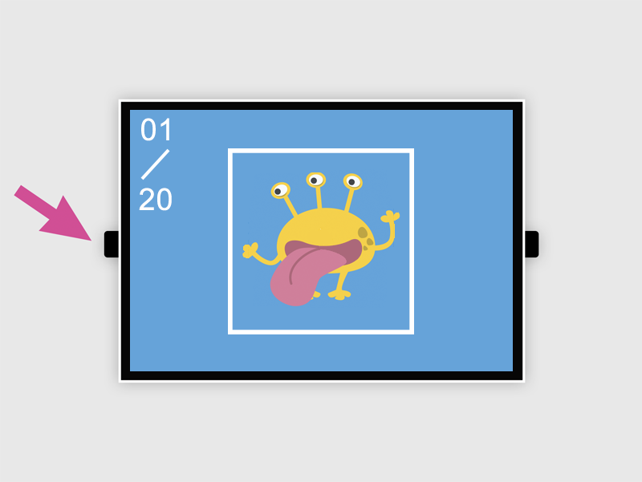
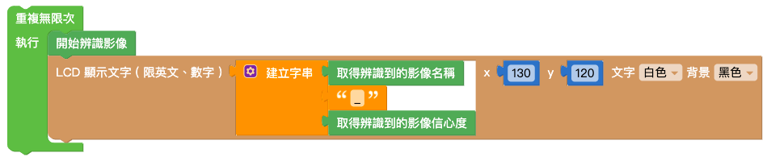
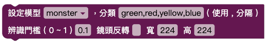
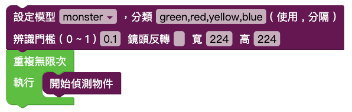

# 三、影像訓練

Web:AI 影像辨識分為 **影像分類** 以及 **物件追蹤**，可以使用 Web:AI 開發板拍攝影像上傳至 Webduino 影像訓練平台進行影像訓練，將訓練完成的模型下載，再使用程式積木執行影像辨識。

## 影像辨識流程

進行影像辨識的流程中，需要先分別建立影像分類，接著選擇要建立的模型種類 ( 影像分類、物件追蹤 )，並將分類放入模型中，就可以使用模型來進行影像辨識了。

## A. 登入影像訓練平台

1. 點擊連結進入 [Webduino 影像訓練平台](https://vision.webduino.io)。

   

2. 點擊「Register」按鈕註冊帳號或使用 Google、FB 帳號直接登入。

   

3. 點擊「同意授權」，進入 Webduino 影像訓練平台。

## B. 建立分類

1. 在 Webduino 影像訓練平台中可以看到左側的側邊欄有「分類」和「模型」兩個選項，點擊「分類」進入分類列表。

   

2. 點擊藍色「新增」按鈕，跳出「建立分類」視窗。

   

    -  輸入分類名稱，**請勿輸入中文、空格、符號**
    -  選擇分享狀態
    -  影像上傳方式點選「Web:AI」，進入下一步

   

    - 輸入要拍照的數量
    - 輸入 Web:AI 開發板的 DeviceID
    - 選擇是否旋轉鏡頭
        - 是：使用後鏡頭 ( 鏡頭在螢幕背面 )
        - 否：使用前鏡頭 ( 鏡頭和螢幕在同一側 )
     > 目前因為鏡頭旋轉功能外殼尚未上市，因此旋轉鏡頭選項**不需勾選**，敬請期待！

3. 點擊「建立分類」按鈕

   

4. 看到「傳送指令成功」訊息，就可以開始使用 Web:AI 開發板拍照。

## C. 使用開發板拍攝影像

傳送指令成功後，開發板會重新啟動，進入拍照模式。

### 拍照模式

- 左上角白色數字：目前拍照張數
- L 按鈕：拍攝照片
- R 按鈕：調整白框大小
- 中間白色方框：拍照時，讓拍攝物件跟方框相當大小

  

讓**拍攝物件跟方框相當大小**時按下 **L 按鈕** 拍攝，並且稍微轉動角度，拍攝不同角度影像。

### 上傳影像

1. 拍完設定的照片數量後，畫面會變全黑，開始上傳圖片。

   

2. 等待上傳完成後，畫面中央會顯示白色 ok，正下方顯示上傳時間。

   

3. 點擊視窗中的 ✕ 或「回到主畫面」，將視窗關閉。

### 建立 2~4 個分類

進行影像辨識時，模型內需要放入 2~4 個分類才能進行辨識，
因此重複上述 **建立分類**、**使用開發板拍攝影像** 步驟，建立兩個以上的分類。

## D. 建立模型

1. 建立完分類後，在左側的側邊欄選擇「模型」，進入模型列表。

   

2. 點擊藍色「新增」按鈕，跳出「新增模型」視窗。

   

    - 輸入模型名稱，**請勿輸入中文、空格、符號或使用過的名稱**
    - 選擇模型種類 ( 影像分類、物件追蹤 )
        
    - 選擇分享狀態
    - 模型建立方式點選「挑選分類」

3. 從分類列表中點選 2~4 個要進行影像辨識的分類，點擊「建立模型」。

   

4. 等待模型訓練完成後，就可以在模型列表中找到建立的模型，並且可以看到模型內的**分類名稱**以及**模型種類**。

   

   > 因為物件追蹤的演算法較複雜，因此訓練時間較久是正常的！

## E. 下載模型

1. 點擊要進行影像辨識的模型，跳出「模型選項」視窗。

    a. 點擊下載模型。

      

    b. 輸入開發板 Device ID。

    

    c. 點擊「下載模型」後傳送指令。

   

2. 點擊「下載模型」按鈕，出現「傳送指令成功」訊息即開始下載模型。

   

3. 完成 100% 後，畫面會顯示 **ok** 字樣代表完成下載，就可以開始進行影像辨識了。

## F. 使用程式積木執行影像辨識

在程式積木平台中，可以分別使用影像分類和物件追蹤積木，來達到不同的影像辨識。

### 影像分類

1. 先依照上面步驟，將訓練過的影像分類模型下載到 Web:AI 開發板中。

2. 開啟 Web:AI 程式積木平台。

3. 使用「設定模型」積木，輸入模型名稱，
在陣列內放入和分類數量相同的積木，按照模型列表的**分類順序**輸入**分類名稱**。
並將寬、高都輸入 224。

   >- 使用 Webduino 影像訓練平台訓練的模型尺寸為 224*224。
   >- 自行使用其它工具訓練，則需輸入各別的尺寸。

   

4. 在下方加入「無限重複」積木，裡面放入「開始辨識影像」積木和「LCD 顯示文字」積木。

    

5. 「LCD 顯示文字」積木內放入「字串組合」積木，後方放入「取得辨識到的影像 ( 名稱 )」積木、「文字」積木輸入底線、「取得辨識到的影像 ( 信心度 )」積木。

    

6. 程式編輯完成後，按下右上角綠色「執行」按鈕，出現「正在努力搬運 Blockly 中...」和「正在組裝積木...」，讀取結束後 Web:AI 開發板會自動開啟辨識畫面。

7. 使用鏡頭對準辨識物件就能看到文字顯示辨識結果和信心度。

   

> 若要使用其它模型來進行影像辨識，需要回到步驟 **下載模型**，再次下載模型。
 
### 物件追蹤

1. 先依照上面步驟，將訓練過的物件追蹤模型下載到 Web:AI 開發板中。

2. 開啟 Web:AI 程式積木平台。

3. 使用「設定模型」積木，輸入模型名稱，
在陣列內放入和分類數量相同的積木，按照模型列表的**分類順序**輸入**分類名稱**。
並將寬、高都輸入 224。

   >- 使用 Webduino 影像訓練平台訓練的模型尺寸為 224*224。
   >- 使用開發板預設的模型請輸入 320*240。
   >- 自行使用其它工具訓練，則需輸入各別的尺寸。

   

4. 在下方加入「無限重複」積木，裡面放入「開始偵測物件」積木和「LCD 顯示文字」積木。

   

5. 編輯物件追蹤的相關程式，讓偵測時可以讀取到模型 ( 陣列 ) 內的分類，並且在螢幕上顯示需要的數值，如下圖設定：

   

6. 將編輯好的程式放在「開始偵測物件」積木下方。

   

7. 程式編輯完成後，按下右上角「執行」按鈕，出現「正在努力搬運 Blockly 中…」和「正在組裝積木…」，讀取結束後 Web:AI 開發板會自動開啟辨識畫面。

8. 使用鏡頭對準辨識物件就能看到白框顯示辨識結果和座標。

   
