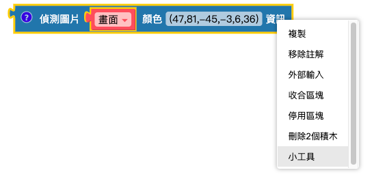
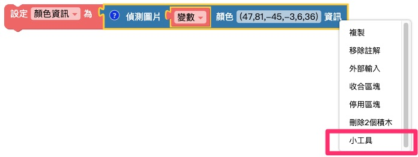

# 颜色追踪

驾驶看到红灯就知道要停、看到绿灯知道要前进，这是因为人能够通过眼球、视神经、中枢神经系统感知并判别颜色，进一步根据看到的颜色做出反应，而Web:AI 开发板可以实现相类似的功能。

我们可以使用[Webduino 选色器](https://ai-blockly.webduino.io/pickerLABColor.html) 取出拍摄到的指定颜色，告诉程序侦测到此颜色时，需要做出什么样的互动，让Web:AI 能够像驾驶一样对不同颜色做出反应。

## 照相画面

「拍摄照片」积木可以使用镜头拍摄一次画面，配合「无限循环」积木就可以达成相机取景器的效果。

另外也可以使用「变量」积木替拍摄照片命名，通过命名来做出更多变化。

> 以上两种积木组合方式执行后会达到相同的结果，差别在于若是要做出更多应用变化，就需要搭配「变量」积木的命名。

### 画面上画文字

Web:AI 能够在屏幕画面或图片上显示文字，这时就需要搭配「图片上画文字」积木。

> 请特别注意，「图片上画文字」积木需要放在「LCD 显示图片」积木之前！

## 侦测图片颜色信息

「侦测图片颜色信息」积木可以输入指定的 LAB 色码，当 Web:AI 镜头拍摄到颜色时，就会将颜色区块框起来。

> 有关LAB 色彩空间的原理，请参考：[CIELAB色彩空间维基百科](https://zh.wikipedia.org/wiki/CIELAB%E8%89%B2%E5%BD%A9%E7%A9%BA %E9%97%B4)。

## Webduino 选色器

### A. 进入 Webduino 选色器

对着「侦测图片颜色信息」积木按下右键，点击「小工具」即可进入 [Webduino 选色器](https://ai-blockly-staging.webduino.io/pickerLABColor.html)。

### B. 使用方式

Webduino 选色器的介面及使用方式如下：

1. 摄像头画面：左侧画面为电脑摄像头拍摄到的画面，将被取色的物品放置在电脑摄像头前方拍摄。 ( 记得开启电脑摄像头权限！ )

2. 选取颜色：右侧画面为选取到的颜色。
    - 白色：选取的颜色
    - 黑色：被过滤掉的其他颜色

3. 调色拉杆：调动 6 个拉杆，让 " 选取颜色 " 中仅剩选取的色块是白色。 ( 拉杆分别控制：亮度、红绿、蓝黄 )

4. 贴上色码：当颜色选取完成后，下方色码复制，贴到「侦测图片颜色信息」积木，即可完成颜色追踪设定。

    

5. 查询色码：未来需要查询特定色码是何种颜色时，可以将色码贴在 " 查询色码 " 栏位中，按下送出即可查看 " 选取颜色 "。

## 颜色信息

「颜色信息」积木可以针对侦测的颜色，回报色块的信息，包含 x、y 座标、像素数量 ( 面积 )、旋转角度。

## 示例：追踪红色

1. 先使用「变量」积木将拍摄照片命名为「画面」，做出镜头画面。

    

2. 取出「侦测图片颜色信息」积木，按下右键，点选选单中的「小工具」，进入[Webduino 选色器](https://ai-blockly.webduino.io/pickerLABColor.html) 。

   

3. 使用选色器选取颜色，再将色码贴到「侦测图片颜色信息」积木。

    

    

4. 完成如下图程序，执行后会将侦测到的红色色块用方框框起。

    

5. 为了让程序多一些互动，我们再设计让开发板侦测到红色时会告知「红色」。

> 设定 " 像素素量 > 10 " 是为了减少背景颜色的干扰，避免屏幕不断显示「红色」。

