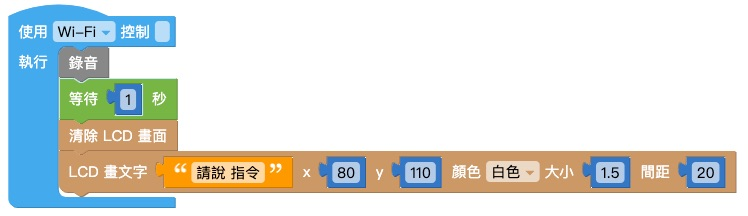

# 语音辨识

Web:AI 能够将收录到的声音转换成数字信号，经过处理后储存成声音模型，当侦测到声音时，会开始和开发板储存的声音模型比对音色、频率，进而得到辨识结果。

## 录制语音

「录制语音」积木能够通过开发板上的麦克风接收声音，并转换成声音模型储存，开发板中最多可以同时储存 10 个模型并做辨识。

- 录音的时间约 1.5 秒
- 录制完所生成的声音模型会一直存放在开发板中，除非经过固件更新或擦除，或是录制时采用了相同编号而把旧的模型覆盖掉。

> 使用「录制语音」积木建立声音模型并不会覆盖 **教学示例卡：语音互动** 中的声音模型，可以放心使用！
>
> 欢迎参考：[教学示例卡使用教学：语音互动](https://bpi-steam.com/WebAI/zh/Unboxing/Card.html#B.%E8%AF%AD%E9%9F%B3%E4%BA%92%E5%8A%A8)。

## 语音辨识

当开发板的麦克风侦测到声音时，如果符合声音模型，就会自动执行「语音辨识」积木中的内容。

「语音辨识」积木的号码和名称会和「录制语音」积木互相对应。

## 语音辨识门槛

因为每个人的音色、频率都不同，所以针对不同应用需要调整辨识门槛才能达到合适的效果。
而「语音辨识门槛」是语音辨识的精准度，门槛越高代表声音越像才会辨识成功。

> 「语音辨识门槛」积木需要放在「语音辨识」积木之前！

## 示例：声控图案

### 录音

1. 结合「画文字」积木和「录制语音」积木，录音时显示「请说 XX」；录音完成时显示「录音 XX 完成」。

    

2. 做出另一组相同的积木，如下图：

    

3. 将 1. 和 2. 的两组积木组合，并用「等待」积木和「清除 LCD 画面积木」隔开，再放入「函数」积木中，将函数命名为「录音」。

    

4. 将函数「录音」放入「开发板」积木中，在下方再放入其它积木，如下图即完成录音程序。

   

### 辨识

1. 首先放入「语音辨识门槛」积木，可以根据辨识的状况改变门槛高低。

   

2. 使用「语音辨识」积木，当听到录制的单词时，会做出后续的程序。

    

3. 复制 2. 的积木，并做出另一组积木。

    

4. 将积木组合，按下**执行**即可在Web:AI上执行语音辨识应用。

<!-- ## 示例：辨识 4 色语音

### 录音

1. 结合「画文字」积木和「录制语音」积木，并用「函数」积木将积木组合。

    

2. 复制出 3 组同样的积木，更改成「蓝色」、「绿色」、「黄色」，做出如下图。

> 记得更改：
> - 函数名称
> - 画文字
> - 语音号码
> - 语音名称

3. 将「函数」积木放入「开发板」积木中，并用「清除 LCD 画面」积木区隔，避免文字被覆盖。

    

### 辨识 -->