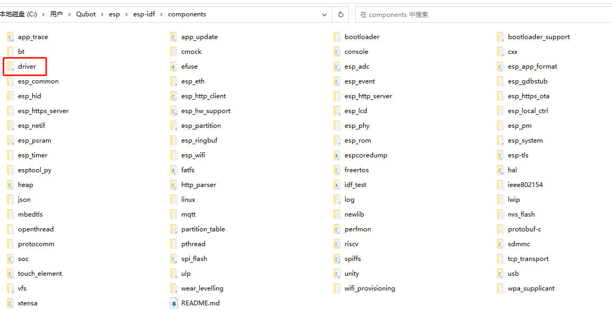
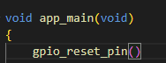
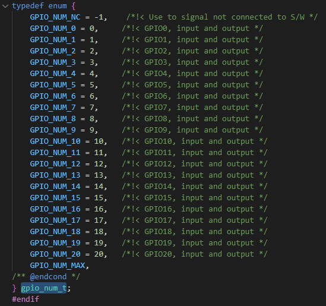
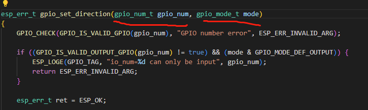
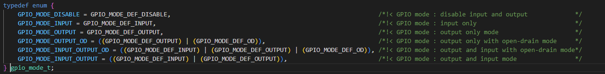
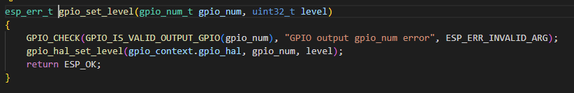

本系列旨在交流 ESP32-S3 硬件开发环境的搭建，通过一些基本的示例来展示怎么用 ESP-IDF (Espressif IoT Development Framework) 来安装、配置环境，并编译、下载固件至 BPI-Leaf-S3 开发板等步骤。如果有什么没提到或者有问题的，欢迎各位留言交流。

<!-- more -->

原文链接: https://qubot.org/2023/03/31/blink-via-esp-idf-with-bananapi-bpi-leaf-s3

作者：[Qubot](https://qubot.org) 

参考文献：https://www.bilibili.com/video/BV1nR4y1o7VE

## 前言
在[这篇文章](./esp_idf_print_log.md) 中，我们学习了如何使用IDF写一个Hello World，接下来我们尝试着来一个硬件界的Hello World--点灯。并拿点灯举例子，讨论怎么找到一个库并使用起来。

## 开始前的准备

### 必备硬件
* BPI-Leaf-S3开发板：[购买链接](https://item.taobao.com/item.htm?id=677287234553)（其他ESP32-S3板子也可以）


* LED灯 X 1

* 限流电阻 X 1（一般的led都需要，不然可能会烧）

* USB 数据线 (USB-A 转 Type-C)

* 电脑（Windows、Linux 或 macOS都可以）

### 必备软件

* 安装好的ESP-IDF环境，安装方法可以[参考这里](./esp_idf_setup.md)

* VS Code

## 查找库

之前我们在[香蕉派 BPI-Leaf-S3的正确吃法之ESP-IDF创建循环](./esp_idf_loop.md)文章里面提到，想要找到IDF的库，需要在esp-idf\components这个目录看，可以看到这个目录里面有这些库：



其中gpio属于硬件驱动部分，所以应该在driver目录下面，找到里面的includ，打开deiver，再往下看就能看到：


所以调用的库应该是
```c
#include "driver/gpio.h"
```

另外要想使灯闪烁，那就需要延迟，就上次用到的库：

```c
#include "freertos/FreeRTOS.h"
#include "freertos/Task.h"
```

## GPIO使用

要想使用某个gpio，我们需要首先将这个gpio初始化，就要用到gpio_reset_pin()函数了,在代码中输入这个函数，然后Ctrl+左键点击gpio_reset_pin()，就能转跳到这个函数定义的地方：



如图，这里是定义的地方，其中括号里需要填的变量就是gpio number，而gpio number具体是怎么填，就需要Ctrl+左键点击gpio_num_t这个类型定义


可以看到，这里定义GPIO名字，这里我用的是gpio4，所以括号内填GPIO_NUM_4或者4都可以



```c
gpio_reset_pin(4)
```

或者

```c
gpio_reset_pin(GPIO_NUM_4)
```

然后是和arduino里面一样，设置输入输出，就是用到gpio_set_direction()函数，至于里面怎么填，Ctrl+左键转跳到定义的地方，如下所示：



可以看到，里面需要填两个参数，一个是gpio munber，另一个是mode，而mode是什么，我们Ctrl+左键点击变量类型“gpio_mode_t”继续看定义的地方：



可以看到这是一个枚举类型，其中有六种类型，我们是点灯，所以是输出，即GPIO_MODE_OUTPUT这个类型，所以：

```c
gpio_set_direction(4,GPIO_MODE_OUTPUT);
```

接下来是点灯，while循环，然后while循环内加上我们的点灯代码：

```c
while(true)
    {
        
    }
```

输出高低电平用到的函数是gpio_set_level()函数，同样的，用Ctrl+左键找到定义的地方：



可以看到，里面填number和level，其中level是一个uint32的类型，我们可以在最上面新建一个uint32的变量：

```c
uint_t status = 0;
```

然后在gpio_set_level()变量中加入值

```c
gpio_set_level(4,status);
```

想要闪烁，就得将状态取个反：

```c
status= !status;
```

最后加上之前文章提到的延迟，最终结果就是：

```c
#include <stdio.h>
#include "driver/gpio.h"
#include "freertos/FreeRTOS.h"
#include "freertos/Task.h"

int delaytime = 1000;
uint32_t status = 0;

void app_main(void)
{
    gpio_reset_pin(4);
    gpio_set_direction(4,GPIO_MODE_OUTPUT);

    while(true)
    {
        gpio_set_level(4,status);
        status= !status;
        vTaskDelay(delaytime/portTICK_PERIOD_MS);  // 100 Ticks=1ms
    }
}
```

下载到板子上面后，这个是最终效果：

<video src="../assets/blink_with_idf_9.mp4" controls="controls" preload="auto">your brower not support play video</video>

## 总结

循环在我们程序中非常常见，我们这篇文章回顾了循环的用法，简单了解了freertos的分时运行，以及如何使用vTaskDelay函数做出arduino中delay的效果。