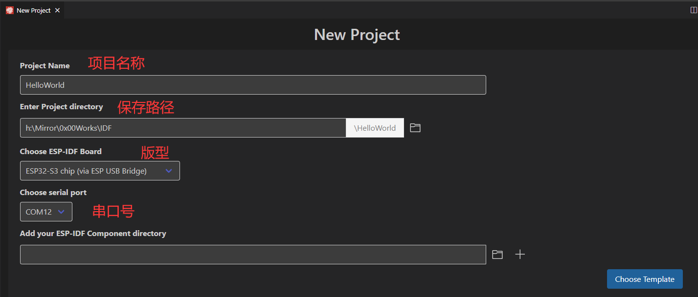
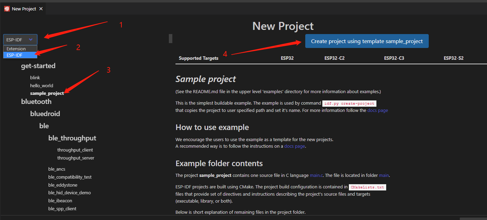
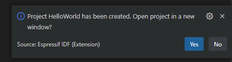
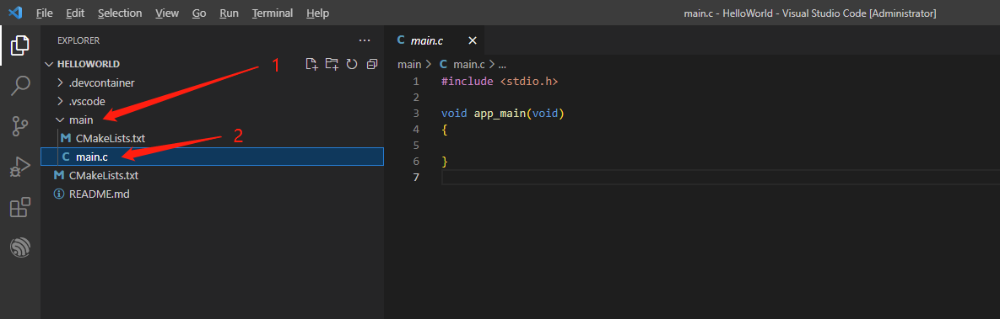
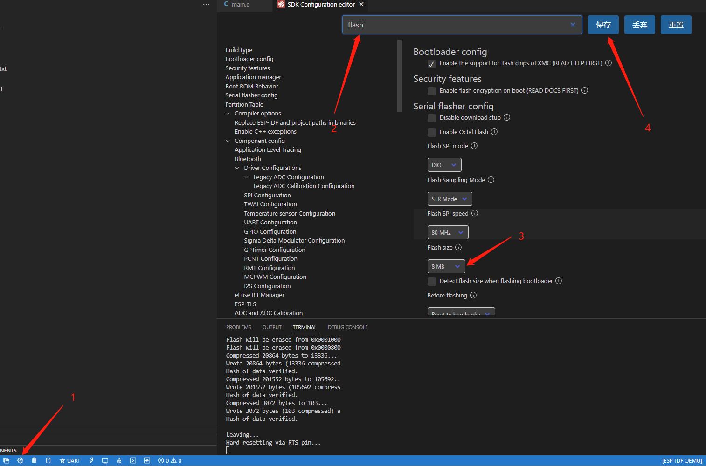
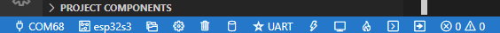
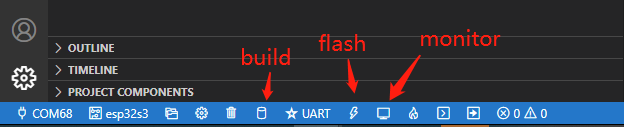
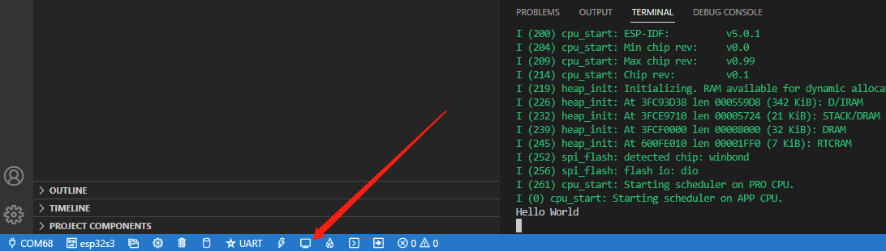

本系列旨在交流 ESP32-S3 硬件开发环境的搭建，通过一些基本的示例来展示怎么用 ESP-IDF (Espressif IoT Development Framework) 来安装、配置环境，并编译、下载固件至 ESP32-S3 开发板等步骤。如果有什么没提到或者有问题的，欢迎各位留言交流。

<!-- more -->

原文链接: https://qubot.org/2023/03/22/build-a-new-esp-idf-project-for-bananapi-bpi-leaf-s3/
作者：[Qubot](https://qubot.org) 

## 前言
上一篇文章介绍了ESP-IDF的安装，这一篇文章来创建一个IDF项目，并将它下载到我们的Leaf-S3上。

## 安装前的准备

### 必备硬件
* BPI-Leaf-S3开发板：[购买链接](https://item.taobao.com/item.htm?id=677287234553)（其他ESP32-S3板子也可以）


* USB 数据线 (USB-A 转 Type-C)

* 电脑（Windows、Linux 或 macOS都可以）

### 必备软件

* 安装好的ESP-IDF环境，安装方法可以[参考这里](./esp_idf_setup.md)

* VS Code

## 新建项目

首先是打开VSCode，Ctrl+Shift+P打开Command palette，输入ESP-IDF: New roject并选择第一个选项。


然后选择项目名称，路径，板子的版型以及串口号，需要注意的是，如果你是第一次使用BPI-Leaf-S3，你需要按住boot键后复位，进入到下载模式，选择完毕后，点击左下角的Choose Template按键.



接下来就是根据模板创建项目，左上角选择ESP-IDF,然后选择get-start下面的hello_world(也可以选其他的，根据你的需求)，最后点击右边上面的使用start下面的hello_world模板创建项目。 



然后左下角会弹出窗口，项目已经创建好，问是否在新窗口打开项目，这里点yes。



这时VSCode会打开一个新窗口，之前的那个窗口就可以关闭了，看到新窗口中左边目录的main->main.c，双击打开，这个就是我们的主程序了。



## 下载代码

项目创建完成之后，将代码输进去，这只是一个输出Hello World的代码，其中\n是换行

```c
#include <stdio.h>

void app_main(void)
{
    printf("Hello World \n");
}
```

由于我们的板子是8M的flash，所以需要配置一下Flash的大小，点一下左下角的齿轮按钮（nemuconfig），等一下之后会出现一个窗口，在上面的搜索框输入flash，找到Flash size，选择8MB，点击保存之后关掉窗口即可。



配置好了之后，看一下左下角这些按键，左下角有一堆按钮，其中第一个为选择串口（就是选择你开发板的COM口），第二个是选择版型（ESP32/ESP32-S2/ESP32-S3等等），第三个是打开新的IDF项目，第四个是menuconfig配置，第五个是清除所有缓存（中间文件之类的？），第六个是build整个项目，第七个是选择烧录方式（jtag，串口，dfu），第八个是烧录键，第九个是打开串口监视器，第十个是build并烧录，打开串口监视器，第十一个是打开IDF的终端（如果你习惯了命令的话，可以在这里输入命令执行），第十二个好像是可以自定义按钮？执行自定义任务。



熟悉完按键就能编译下载了，点击左下角第六个build按钮开始编译，编译结束之后，点击flash按钮，等显示Hard resetting via RTS pin...的时候就说明下载完成了，这时候需要按一下板子的复位键。



复位完成之后，点击左下角的monitor按键，这时会出现一堆输出信息，可以看到最下面有一段Hello world，这就说明下载完成了，代码开始运行。



## 总结

这一步我们熟悉了如何将程序下载到板子上面，运行了最简单的Hello World程序，整体上没有什么大的难点，主要是BPI-Leaf-S3用的是原生USB，需要手动进到下载模式，等第一次烧录完IDF代码后，后面就不用进下载模式了。