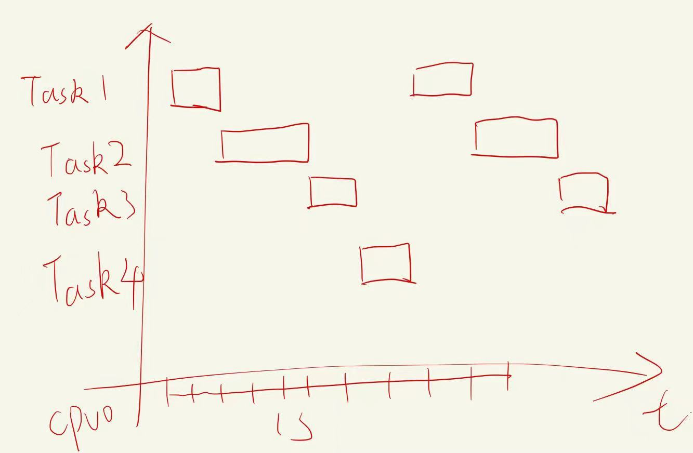
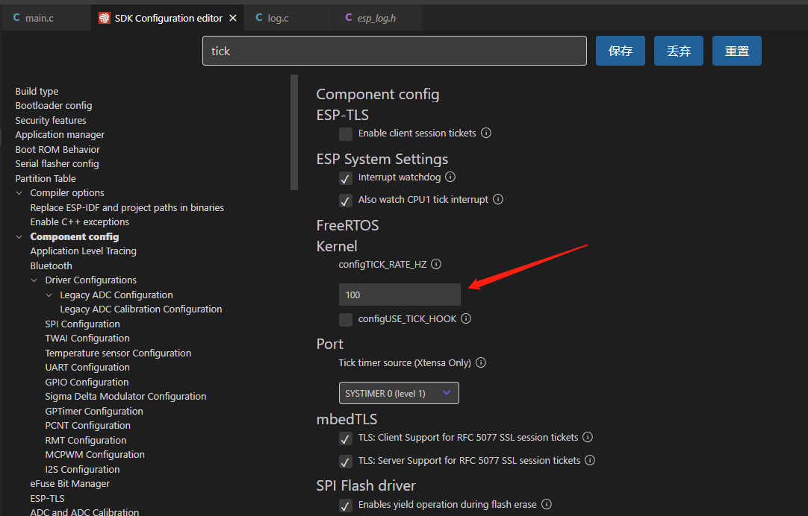
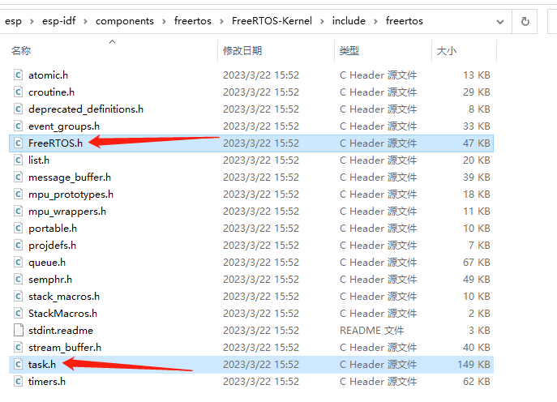
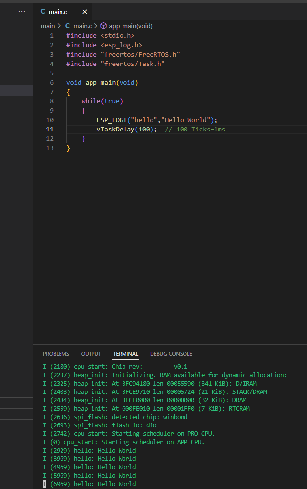
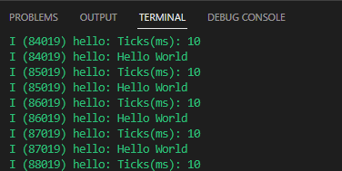

本系列旨在交流 ESP32-S3 硬件开发环境的搭建，通过一些基本的示例来展示怎么用 ESP-IDF (Espressif IoT Development Framework) 来安装、配置环境，并编译、下载固件至 BPI-Leaf-S3 开发板等步骤。如果有什么没提到或者有问题的，欢迎各位留言交流。

<!-- more -->

原文链接: https://qubot.org/2023/03/28/build-loop-in-esp-idf-with-bananapi-bpi-leaf-s3

作者：[Qubot](https://qubot.org) 

参考文献：https://www.bilibili.com/video/BV1S3411f71Z/

## 前言
在Arduino中，有setup和loop两个函数，但是在ESP-IDF中没有loop函数，那在ESP-IDF中的循环是怎么实现的呢？这次我们来讨论一下

## 开始前的准备

### 必备硬件
* BPI-Leaf-S3开发板：[购买链接](https://item.taobao.com/item.htm?id=677287234553)（其他ESP32-S3板子也可以）


* USB 数据线 (USB-A 转 Type-C)

* 电脑（Windows、Linux 或 macOS都可以）

### 必备软件

* 安装好的ESP-IDF环境，安装方法可以[参考这里](./esp_idf_setup.md)

* VS Code

## 创建循环

在Arduino中，如果想要不停循环输出，只需把想要循环的内容放到loop里面就行，如下面例子所示，每1秒会输出一次Hello World：

```c
void setup() {
  // initialize serial communication at 9600 bits per second:
  Serial.begin(9600);
}

void loop() {
  // print out Hello World:
  Serial.println("Hello World");
  // delay between each print：
  delay(1000);
}
```

但是在IDF中，是没有loop的，我们可以利用while或者for直接写成死循环：

```c
whild(true)
{

}
```

或者

```c
for(;;)
{
    
}
```

而输出可以利用pringf()或者上一篇文章所写的ESP_LOGI(),但是不能只写输出，还得加上延迟，在IDF中，没有delay(1000)这个函数，我们这里得用到freertos里的trick，这是我们需要了解一下分时的概念。

## ticks的概念

FreeRTOS是一个实时操作系统，它会在一定时间内轮流执行所有任务，而宏观的来看，就像是在同时运行一样，而在FreeRTOS中，时间的最小单位就是1 tick。



在实际程序中，你可以分配每个任务执行多少个ticks,这个值是可以自己设定的，默认1个tick是10ms，这个在menuconfig中就可以设置，如下图所示，搜索tick即可看到



## ticks的使用

要想使用ticks，那么必须引用ticks的库，类似于Arduino的libraries文件夹，IDF的库一般都在esp-idf安装目录的components文件夹，就是第一篇文章中的esp-idf安装目录，我的在C:\Users\Qubot\esp\esp-idf\components这里，在这里能看到，有一个freertos文件夹，而在这个目录下，就是FreeRTOS具体的库分类，打开FreeRTOS-Kernel\include\freertos（Mac和linux下可能不太一样）可以看到如下所有库，其中Task是我们delay要用到的，而FreeRTOS.h也是Task要调用的库。



在代码最前面加上

```c
#include "freertos/FreeRTOS.h"
#include "freertos/Task.h"
```

如果最上面显示库没找到，那么可以Ctrl+Shift+P打开command，输入并选择ESP-IDF: Add vscode configuration folder导入库


在IDF中，delay用的是vTaskDelay()这个函数，所以完整的代码如下：

```c
#include <stdio.h>
#include <esp_log.h>
#include "freertos/FreeRTOS.h"
#include "freertos/Task.h"

void app_main(void)
{
    while(true)
    {
        ESP_LOGI("hello","Hello World");
        vTaskDelay(100);
    }
}
```

下载到板子上之后，会发现，串口会1s输出一次Hello World，下面每一行前面的括号内的数字为启动之后的毫秒数




## ticks的高级用法

上面有提到，menuconfig里面能修改ticks的频率，那一旦我们改了频率，代码中的值就需要改变，这时我们就需要用到一个常量：portTICK_PERIOD_MS,我们把它输出出来：

```c
ESP_LOGI("hello","Ticks(ms): %lu", portTICK_PERIOD_MS);

```

可以看到每个Ticks是10ms，也就是我们menuconfig中设置的tick频率100hz。



所以我们可以新建一个变量，例如

```c
int delaytime = 1000;
```

然后将delaytime/portTICK_PERIOD_MS放到vTaskDelay函数内就行了，如下例子：

```c
#include <stdio.h>
#include <esp_log.h>
#include "freertos/FreeRTOS.h"
#include "freertos/Task.h"

int delaytime = 1000;

void app_main(void)
{
    while(true)
    {
        ESP_LOGI("hello","Ticks(ms): %lu", portTICK_PERIOD_MS);
        ESP_LOGI("hello","Hello World");
        vTaskDelay(delaytime/portTICK_PERIOD_MS);  // 100 Ticks=1ms
    }
}
```

以后不管menuconfig中怎么配置频率，想要delay多久，直接改delaytime这个函数就可以了

## 总结

循环在我们程序中非常常见，我们这篇文章回顾了循环的用法，简单了解了freertos的分时运行，以及如何使用vTaskDelay函数做出arduino中delay的效果。