本系列旨在交流 ESP32-S3 硬件开发环境的搭建，通过一些基本的示例来展示怎么用 ESP-IDF (Espressif IoT Development Framework) 来安装、配置环境，并编译、下载固件至 BPI-Leaf-S3 开发板等步骤。如果有什么没提到或者有问题的，欢迎各位留言交流。

<!-- more -->

原文链接: https://qubot.org/2023/03/27/print-log-in-esp-idf-with-bananapi-bpi-leaf-s3/

作者：[Qubot](https://qubot.org) 

参考文献：https://www.bilibili.com/video/BV1KG4y1d7Ed/

## 前言
在Arduino中，关于串口输出，只有Serial.print()这一个函数能够通过串口输出日志/报错等，但是在ESP-IDF中，有好几种输出方式。这篇文章我们来聊一聊ESP32-S3在IDF中输出串口的多种方式

## 安装前的准备

### 必备硬件
* BPI-Leaf-S3开发板：[购买链接](https://item.taobao.com/item.htm?id=677287234553)（其他ESP32-S3板子也可以）


* USB 数据线 (USB-A 转 Type-C)

* 电脑（Windows、Linux 或 macOS都可以）

### 必备软件

* 安装好的ESP-IDF环境，安装方法可以[参考这里](./esp_idf_setup.md)

* VS Code

## 设置串口

在Arduino中，设置ESP32-S3的串口输出波特率是通过Serial.begin(9600)这个方法，而串口监视器的波特率是在打开串口监视器之后，点击右下角菜单选择的，如下图所示。


而在ESP-IDF中不是这样的，在ESP-IDF中，需要在Menuconfig中设置。点击左下角第四个按钮，打开menuconfig设置

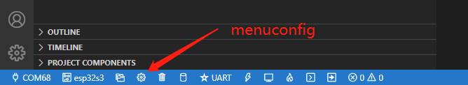

然后按照如图步骤：①在搜索框内输入uart，②点击channel for console output下面的下拉菜单，③选择custom UART，④在UART console baud rate这一栏改成你想要的波特率（默认是115200），⑤点击保存并关闭窗口。这样我们就配置完毕了。
（注意我这里写的时候使用的ESP-IDF版本可能和[孤独的二进制](https://space.bilibili.com/1375767826)使用的不太一样，他使用的版本还有monitor选项，即串口监视器的波特率设置。我这里没有monitor选项，可能集成到uart里面了？我测试过修改波特率之后在IDF的monitor中直接能打开，在Arduino IDE的串口监视器中修改成对应的波特率之后也能打开）


## 日志功能的使用

要想使用日志功能，我们需要先引入日志的库

```c
#include <esp_log.h>
```

将鼠标对准“esp_log”，并右键>Go to Definition（或者对准这个按下F12，或者Ctrl+左键），会弹出一个小窗口，这个就是这个库的定义。

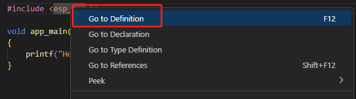

左键点击图中箭头的位置，会在新窗口中打开这个库

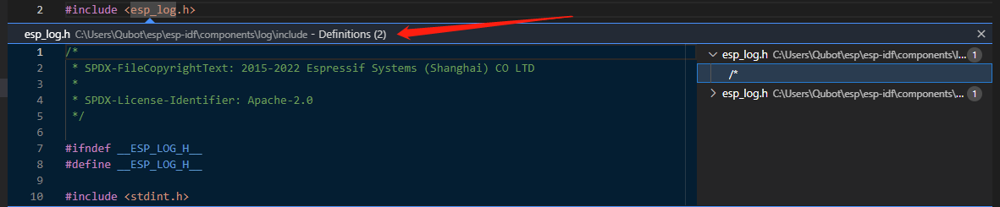

可以看到这里有一些日志类型的定义，我们可以在代码中写下所有的日志，并根据实际情况调整当前输出等级，从而控制日志输出的详细情况，比如调试的时候就切换成debug状态，让他输出debug信息，交付之后调成error，让它只显示报错。

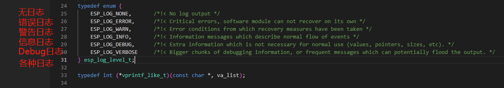

如果你想输出一个信息，就是ESP_LOG后面加信息类型，例如如果你想要错误信息，那就是ESP_LOGE(tag,"你的信息")

接下来我们看一个例子

```c
#include <stdio.h>
#include <esp_log.h>

void app_main(void)
{
    printf("Hello World \n");

    // E error,
    ESP_LOGE("香蕉库存","一个不剩");
    // W warning;
    ESP_LOGW("香蕉库存","香蕉只剩下2根了");

    // I Information;
    ESP_LOGI("香蕉库存","香蕉还剩一吨");
    
    // D Debug;
    ESP_LOGD("香蕉库存", "香蕉还剩1吨, 已经消耗2吨.");
    
    // V Verbose;
    ESP_LOGV("香蕉库存", "香蕉还剩5吨, 已经消耗3吨. 每天消耗一吨, 还能撑5天");

}
```

点击左下角build,flash and monitor按钮，将这个例子下载到板子上面之后，你会发现串口输出只有E，W，I这三种信息，因为默认情况下IDF设置成的是INFO等级，选中这个等级意味着，information及以上的信息都会输出，这个输出等级需要在menuconfig里面设置一下。

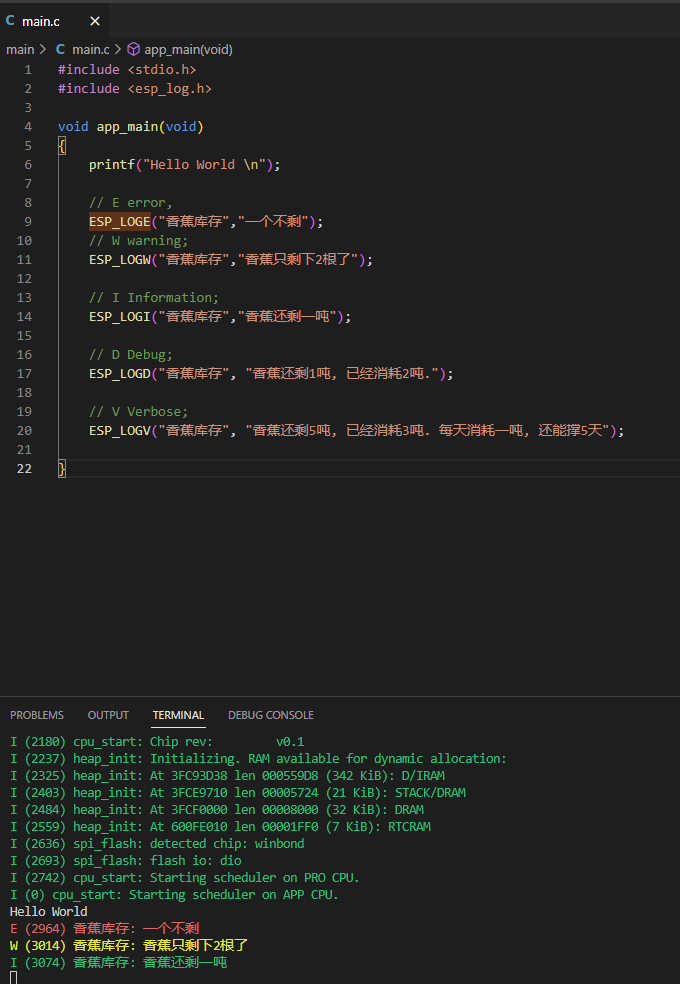

点击左下角menuconfig键，并在搜索框中输入log，如图我们能找到一个Log output的配置。将这个配置改成Verbose，这样Verbose及以上的信息才会都输出出来，最后一定记得要保存并关闭窗口。这样我们就能够看到所有的日志信息了。

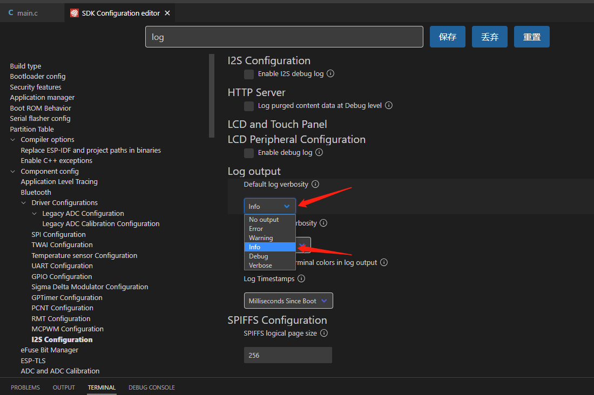

存储完之后，我们再次点击左下角build,flash and monitor按钮，将这个例子下载到板子上面之后，串口的输出就变成完整的所有信息了。

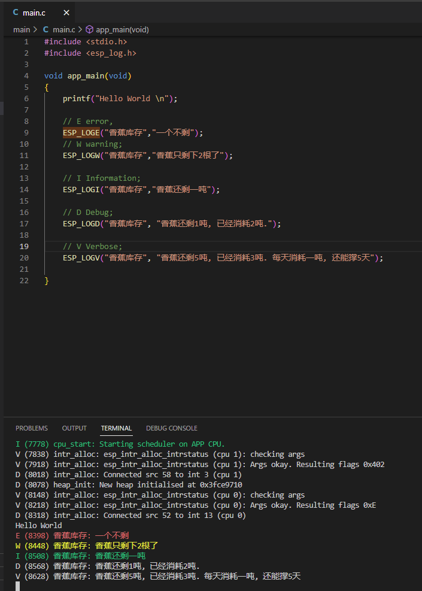

另外我们在esp_log中可以看到这些输出信息的定义

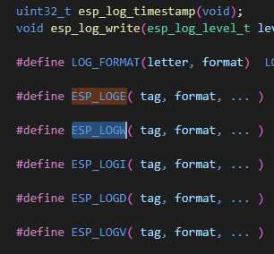

可以看到上面的"香蕉库存"是一个tag，我们可以用字符给它代替掉，以及后面的变量也可以通过%i代替掉，如下所示：

```c
#include <stdio.h>
#include <esp_log.h>

const char* banana_storage ="香蕉库存";
void app_main(void)
{
    printf("Hello World \n");

    // E error,
    ESP_LOGE(banana_storage,"一个不剩");
    // W warning;
    ESP_LOGW(banana_storage,"香蕉只剩下%i根了",2);

    // I Information;
    ESP_LOGI(banana_storage,"香蕉还剩%i吨",1);
    
    // D Debug;
    ESP_LOGD(banana_storage, "香蕉还剩1吨, 已经消耗2吨.");
    
    // V Verbose;
    ESP_LOGV(banana_storage, "香蕉还剩5吨, 已经消耗3吨. 每天消耗一吨, 还能撑5天");

}
```

## 日志功能的进阶使用

输出怎么使用我们了解了，接下来就是实际应用了，上面只是说到了在menuconfig中手动改，我们也可以在实际程序中利用某个按键或者某个组合键来调整log输出等级。

在代码中，我们可以通过esp_log_level_set()这个函数来改变输出等级，Ctrl+左键可以看到它的定义和使用方法，前面是tag，后面是log的等级。

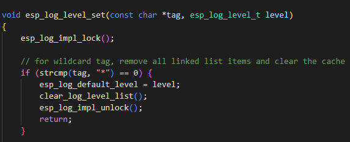

至于等级有哪些？我们可以再次Ctrl+左键，可以看到就是我们刚才看到的这几个等级，这样，我们通过esp_log_level_set(banana_storage,ESP_LOG_VERBOSE)就能将输出等级设置为Verbose状态了。

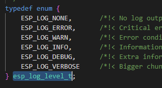

然后我们回到menuconfig中的log设置这里，可以看到这里有两个选项，一个是Default log verbosity，即默认输出等级，另一个是Maximum log verbosity，即最高输出等级。如图设置之后就是，默认输出等级为info，而最高可以调整到Verbose。保存之后退出

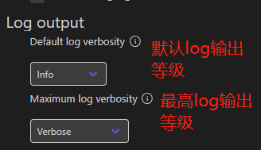

然后在代码中加入一个bool变量（这里有些奇怪，可能库的版本不一样，我在Mac上面的IDF可以直接用bool变量，但是在这里需要引入stdbool.h这个库）

```c
#include <stdbool.h>
bool secretLog = false;
```

加一个判断

```c
if (secretLog == true) {
    esp_log_level_set(banana_storage,ESP_LOG_VERBOSE);
}
```

最终如下

```c
#include <stdio.h>
#include <esp_log.h>
#include <stdbool.h>

const char* banana_storage = "香蕉库存";

bool secretLog = false;

void app_main(void)
{
    if (secretLog == true) {
        esp_log_level_set(banana_storage,ESP_LOG_VERBOSE);
    }

    printf("Hello World \n");

    // E error,
    ESP_LOGE(banana_storage,"一个不剩");
    // W warning;
    ESP_LOGW(banana_storage,"香蕉只剩下%i根了",2);

    // I Information;
    ESP_LOGI(banana_storage,"香蕉还剩%i吨",1);
    
    // D Debug;
    ESP_LOGD(banana_storage, "香蕉还剩1吨, 已经消耗2吨.");
    
    // V Verbose;
    ESP_LOGV(banana_storage, "香蕉还剩5吨, 已经消耗3吨. 每天消耗一吨, 还能撑5天");

}
```

下载到板子上之后会发现，目前串口输出只有E,W,I，如下所示

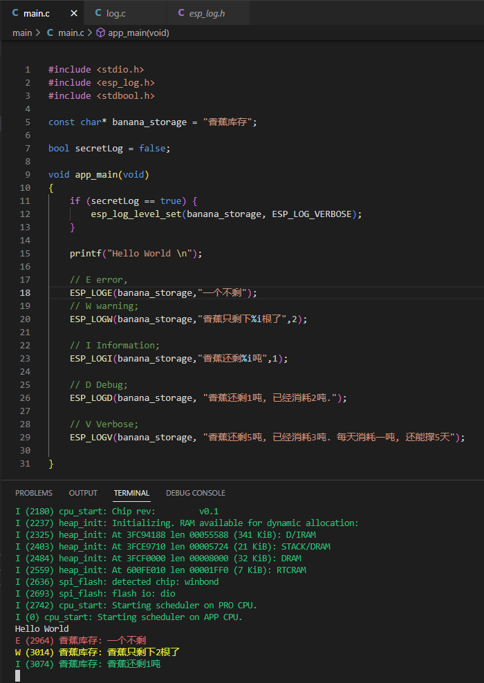

然后我们将

```c
bool secretLog = false;
```

改为

```c
bool secretLog = true;
```

会发现,输出中E,W,I,D,V都出现了

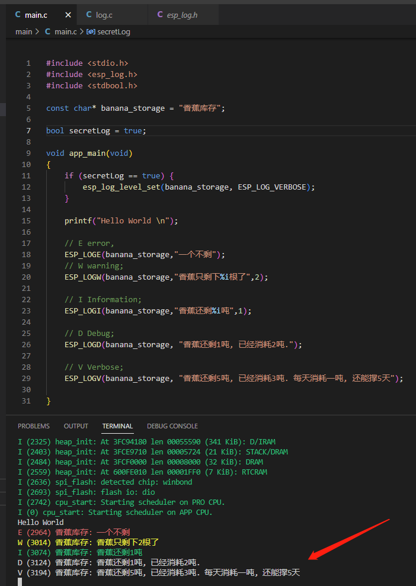

## 总结

日志在我们调试过程中非常重要，本文讨论了如何将日志输出出来，方便我们调试，以及如何通过一个变量隐藏掉部分等级的日志，让用户看不到，或者重新设置为完整输出。